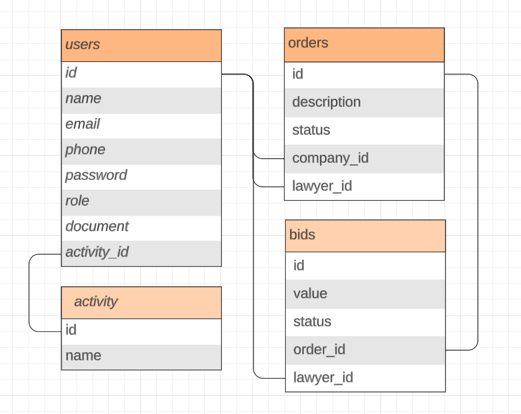

# 📜 Seu Direito - API

Esse projeto tem como objetivo descomplicar a gestão de processos tanto para advogados em busca de oportunidades como para empresas necessitando de profissionais capacitados.

Venha ver como funciona!

## 📖 Instalação

- Navegue à pasta raiz do projeto e instale as dependências via yarn. Em seguida rode o build do projeto.

```bash
  yarn
  
  yarn build
```

## 🔑 Variáveis de ambiente

Para rodar esse projeto localmente, você precisa adicionar essas variáveis no seu arquivo .env

`PORT` A porta que irá rodar a api

`SECRET` O secret JWT

## 🛞 Rodando o projeto

- Para rodar o projeto, use o seguinte comando:

```bash
  yarn start
```

- Use este caso queira rodar o projeto em modo de desenvolvimento:

```bash
  yarn start:dev
```

## 🗄️ Entidades

Por se tratar de um servidor in-memory, ele já conta com algumas entidades do banco de dados, sendo elas:

- Administrador

```bash
    name: 'Admin',
    email: 'admin@email.com',
    password: 'minhasenha',
    role: 'admin'
```

- Empresa

```bash
    name: 'Company',
    email: 'company@email.com',
    password: 'minhasenha',
    role: 'company'
```

- Advogado

```bash
    name: 'Lawyer',
    email: 'lawyer@email.com',
    password: 'minhasenha',
    role: 'lawyer'
```

- Ramo de atividade

```bash
    id: 1
    name: 'Comércio',
```

Assim que esta estruturado o banco de dados:



### 📏 Regras de negócio

O projeto é uma API para criar e gerir ordens de serviço. A navegação é feita da seguinte forma:

- Um usuário empresa cria uma ordem de serviço relacionado a determinado processo que ela queira mover

- Um usuário advogado faz uma oferta para determinada ordem de serviço

- Cabe à empresa aceitar ou negar a oferta da ordem de serviço

- Uma vez concluída a ordem de serviço, a empresa finaliza ela

## 📚 Referência da API

Para entender como navegar em cada endopoint e testa-lo, dê uma olhada no Swagger em:

```http
URL_API:PORT/api
```

## 🧱 Tech Stack

**Server:** Node, Typescript, Nestjs

**Documentação:** Swagger

**Deploy:** Render

**Database:** SQLite

## 🚀 Deploy

- [Server Deploy](https://seu-direito.onrender.com)
- [Documentation (Swagger)](https://seu-direito.onrender.com/api)
